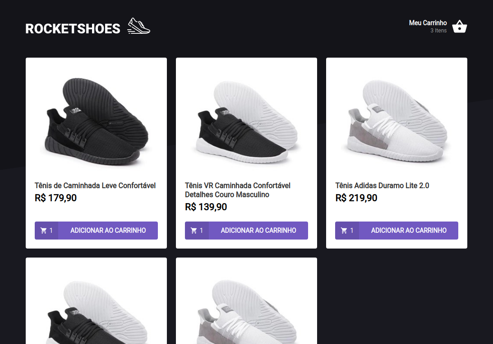
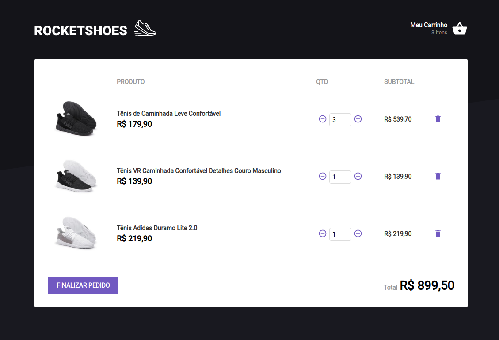

## Mini loja com carrinho de compras

Foi criada uma mini loja utilizando Redux
e o React Saga para gerenciamento de estados.

Tela Inicial

Carrinho

### Instalação do redux e seu pacote de integração com o react

`yarn add redux react-redux`

### Instalação do Reactotron

`yarn add reactotron-react-js reactotron-redux`

### Instalação do Immer

Criar um rascunho do estato atual do reducer. Este rascunho
pode ser editado, por fim tal rascunho é atribuido ao estado
do reducer sem ferir o conceito de imutabilidade.

`yarn add immer`

### Instalação do Redux Saga

`yarn add redux-saga`

### Plugin Reactotro Redux Saga

`yarn add reactotron-redux-saga`

### Instalação do React Toastify

`yarn add react-toastify`

### Instalação do History

Gerencia a History do navegador, "navegação entre rotas".

`yarn add history`
